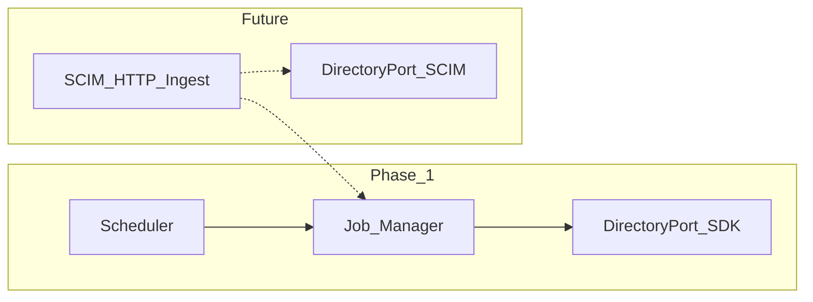

# ADR-001: Event model — scheduled jobs vs SCIM (Phase 1)

**Status:** Accepted  
**Date:** 2026-05-27  
**Related:** [wiki-validation.md](../prd/wiki-validation.md); P2-1; [ADR-004](004-directory-sdk-adapters.md)

---

## Context

The DSG wiki describes a **scheduled, batch-oriented** sync platform: Job Manager creates account-level jobs, publishers pull directory users, workers process per-user `job_detail` messages.

Directory Integration 2.0 PRD (P2-1) envisions **generic SCIM IDP** compatibility and may imply more **event-driven** provisioning. The wiki uses **per-vendor directory REST APIs** (Azure Graph, Okta, Google Admin SDK, OneLogin).

---

## Decision

### Phase 1: scheduled pull + on-demand jobs (no SCIM protocol)

| Mechanism | Used in Phase 1? | Description |
|-----------|------------------|-------------|
| **Incremental scheduler** | Yes | Scan `directory_sync_time`; enqueue INCREMENTAL when prior job terminal |
| **Full sync** | Yes | Admin trigger or scheduled FULL |
| **On-demand** | Yes | Manual sync, preview, selected users, failed-user retry |
| **SCIM inbound webhooks** | **No** | Deferred to P2+ |
| **Real-time IDP push** | **No** | Okta/Azure change feeds consumed inside **job pull**, not separate HTTP webhook to DSG |

Directory changes are **detected during job execution** via:

- Incremental APIs (Azure delta link, Okta system log, Google Admin SDK patterns)
- Full group membership scan
- Hash comparison for mapped fields ([ADR-003](003-rule-triggers-and-action-sets.md))

### Future: optional SCIM layer (P2-1)

Introduce `ScimDirectoryAdapter` implementing `DirectoryPort` without changing worker orchestration:

SCIM would **supplement or replace pull** per account configuration; not required for Phase 1 GA.

### Hybrid note

Some IDPs expose near-real-time **change logs** (Okta System Log). Phase 1 still processes them inside the **existing job pipeline**, not as a separate event bus.

---

## Consequences

### Positive

- Matches wiki job state machine and operational model
- Simpler Phase 1: one orchestration path
- Clear ADR for PM: SCIM is roadmap, not blocker

### Negative

- Latency bounded by scheduler interval (e.g. 4 hours in UX mockup)
- SCIM-only IDPs not supported until adapter exists

---

## References

- [dsg-design-wiki.md](../architecture/dsg-design-wiki.md) §3.3–3.4
- [sync-runtime.md](../architecture/sync-runtime.md)
- [004-directory-sdk-adapters.md](004-directory-sdk-adapters.md)
