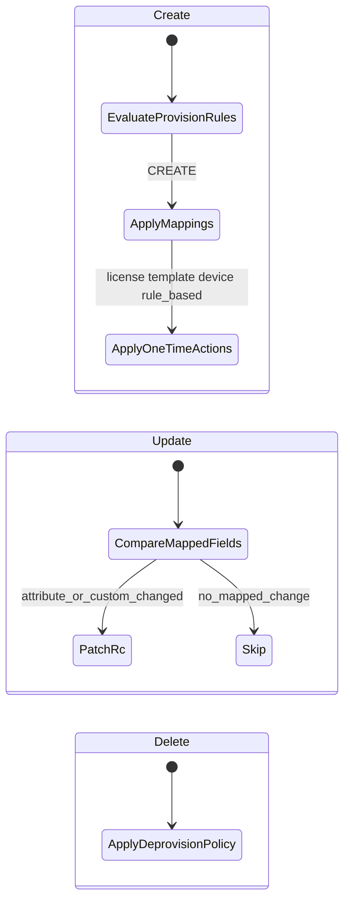

# ADR-003: Rule triggers and action sets (Phase 1)

**Status:** Accepted  
**Date:** 2026-05-27  
**Deciders:** Engineering (planning)  
**Related:** P0-6, P0-8; [gap-resolution.md](../prd/gap-resolution.md#gap-1-three-trigger-types-p0-8-p0-6--closed-phase-1)

---

## Context

Directory Integration 2.0 PRD defines three rule trigger types in a unified Rules Table (P0-8). The DSG wiki models provisioning rules with `selection_expression` and priority but does not define how user **updates** are triggered separately from create/delete.

Product and engineering agreed to simplify Phase 1: updates driven by attribute mapping changes detected after directory fetch, not by a second class of update rules.

---

## Decision

### Trigger model (Phase 1)

| Trigger | When | Mechanism |
|---------|------|-----------|
| **Provision** | `operation` = CREATE (new directory user in scope) | Match `provisioning_assignment_rule` by priority + `selection_expression`; apply Type 1 action set |
| **Change** | `operation` = UPDATE (existing linked user) | Compare directory payload to `directory_sync_user_hash` for fields in `attribute_mapping` and `custom_attribute_mapping`; patch RC only if changed |
| **Delete** | `operation` = DELETE (removed from directory / delete event) | Apply account `deprovisioning_rule` (one of FULL_DELETE, RECLAIM_RESOURCE, DISABLE_ONLY) |

### Action sets per trigger

| Action | Provision (Type 1) | Change (Type 2) | Delete (Type 3) |
|--------|-------------------|-----------------|-----------------|
| `attribute_mapping` | Yes (initial set) | Yes (delta only) | No |
| `custom_attribute_mapping` | Yes (initial set) | Yes (delta only) | No |
| `rule_based_attribute_mapping` | Yes (conditional role/site/cost center) | **No** | No |
| `license_assignment` | Yes | No | N/A (deprovision handles licenses) |
| `template_assignment` | Yes (async; failure does not fail user create) | No | No |
| `device_assignment` | Yes | No | No |
| `dl_area_code_assignment` / number logic (inventory only) | Yes | No | No |
| Deprovision policy | No | No | Yes |

### Change detection

1. Job Detail DB publisher loads directory user (incremental delta or full group membership).
2. Worker computes hash over **only** fields referenced by `attribute_mapping` and `custom_attribute_mapping` for that account/direction.
3. If `external_user_hash` differs from stored hash → enqueue/process UPDATE.
4. If no mapped field changed → skip RC API calls for that user (no-op).
5. On success → update `directory_sync_user_hash`.

Rule-based attributes are **included in hash for provision path evaluation** but are **not** re-evaluated on update in Phase 1.

---

## Consequences

### Positive

- Simpler admin UX: no “update rules” builder in Phase 1
- Aligns with wiki hash optimization and one-time provisioning doctrine
- Clear split: mappings = ongoing sync; provisioning rules = create-only

### Negative / deferred

- Department transfer does not automatically reassign role/site via `rule_based_attribute_mapping` until a later phase
- PRD P0-8 “three trigger types” UI is partially simplified—document in traceability and Confluence

### Follow-up (future phase)

- Optional Type 2 rules with `selection_expression` for conditional updates
- PM confirmation on committed customers needing conditional update behavior

---

## References

- [directory-integration-2.0.md](../prd/directory-integration-2.0.md) — P0-6, P0-8
- [dsg-design-wiki.md](../architecture/dsg-design-wiki.md) — sections 1.1, 2.3.5, 2.4.2
- [traceability.md](../prd/traceability.md)
