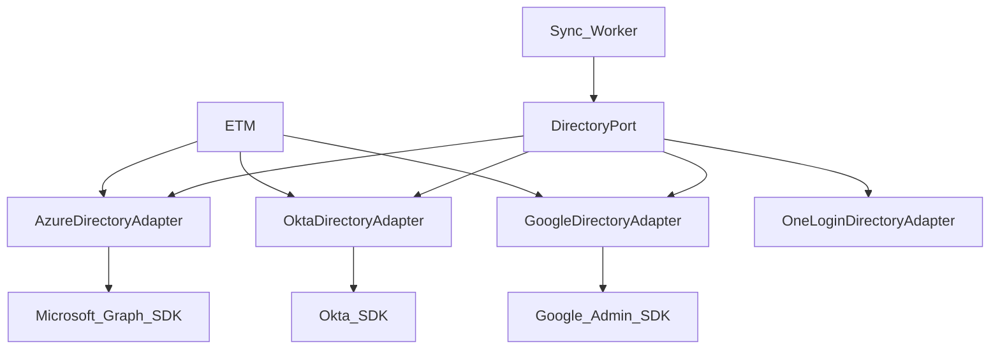

# ADR-004: Directory integration — vendor SDKs (not SCIM)

**Status:** Accepted  
**Date:** 2026-05-27  
**Related:** P2-1 (deferred), P0-3; [gap-resolution.md](../prd/gap-resolution.md#gap-5-directory-integration-sdk-not-scim--closed-phase-1)

---

## Context

The product PRD lists **compatible with any SCIM IDP** (P2-1) as a future architectural goal. The DSG wiki integrates with **vendor-specific directory APIs** (Microsoft Graph, Okta API, Google Admin SDK) — not SCIM protocol endpoints.

Engineering decided Phase 1 will use **official directory SDKs** per cloud provider, with no SCIM API layer.

> **Note on gap numbering:** **Gap 4** in [gap-resolution.md](../prd/gap-resolution.md) is **queue technology** (ElasticMQ/SQS). **Gap 5** is **directory / IDP integration** (this ADR).

---

## Decision

### Phase 1 — vendor SDK adapters

| `directory_type` | SDK / API (wiki reference) | Capabilities used |
|------------------|---------------------------|-------------------|
| Azure | Microsoft Graph SDK | Groups, members, delta (`@odata.deltaLink`) |
| Okta | Okta Java SDK | Groups, users, system log for membership changes |
| Google | Google Admin SDK | Groups, members |
| OneLogin | OneLogin API / SDK | Per OneLogin directory API |

**Authentication:** adapters call [DirectoryAuthPort](008-directory-auth-port.md) only.

| Profile | Tokens from |
|---------|-------------|
| `dsg.auth=dsb-oauth` (Phase 1) | DSB `account_directory_oauth` — encrypted client_id/secret, cached access/refresh |
| `dsg.auth=etm` (future) | ETM via `etm_subscriber_id` — no secrets in DSB |

Adapters never read `client_secret` directly.

### `DirectoryPort` interface (conceptual)

- `listGroupMembers(groupId, checkpoint)` — full or incremental
- `getUser(externalId)` — single user for test run / retry
- `updateUser(externalId, attributes)` — RC → directory write-back (P0-3) where vendor supports it
- `supportsIncrementalSync()` — drives `directory_sync_checkpoint` shape (URL vs timestamp)

Workers and Job Detail DB publisher depend only on **`DirectoryPort`**, not on SDK types.

### Explicitly out of scope Phase 1

- SCIM 2.0 protocol client (inbound or outbound)
- Generic SCIM IDP onboarding via configuration only (PRD P2-1 full criterion)

### Future phase (P2-1)

Optional `ScimDirectoryAdapter` implementing the same `DirectoryPort` for IDPs that only expose SCIM. No change to worker or job orchestration code.

---

## Consequences

### Positive

- Aligns implementation with wiki API tables (section 2.8)
- Better SDK support for delta sync, pagination, and auth than hand-rolled SCIM
- Clear extension point without over-building SCIM now

### Negative / PRD deviation

- P2-1 “any SCIM IDP via config” **deferred** — PM sign-off
- Each new vendor still needs an adapter (or SCIM adapter later), not zero-code onboarding

### P0-3 write-back

Uses the **same SDK adapters** (e.g. Okta profile update). Feasibility and rate limits remain a **spike** per PRD open questions — not blocked by this ADR.

---

## References

- [dsg-design-wiki.md](../architecture/dsg-design-wiki.md) — IDP API table, ETM auth
- [directory-integration-2.0.md](../prd/directory-integration-2.0.md) — P2-1, goals
