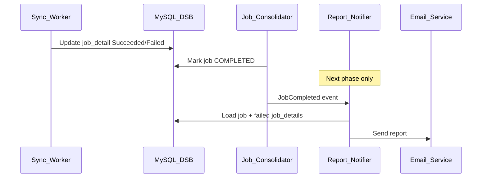

# ADR-005: Sync result reporting and notification (P0-9)

**Status:** Accepted  
**Date:** 2026-05-27  
**Related:** P0-9; [gap-resolution.md](../prd/gap-resolution.md#gap-2-sync-report-notification-p0-9--closed-phase-1--next-phase)

---

## Context

PRD P0-9 requires an execution result report after each directory integration job: success count, failed users with reasons, delivered via **email**. The DSG wiki models `job` and `job_detail` with per-user `comment` for errors but does not define notification delivery.

---

## Decision

### Phase 1 (current delivery — P0 core)

**In scope:**

- Persist full job outcomes in DSB (`job`, `job_detail`) as designed in the wiki
- Job consolidation sets terminal job state (`COMPLETED`, `CANCELLED`)
- Each `job_detail` records: `state_id`, `operation_id`, `external_id`, `source_payload` (PII OK — audit/retry per [ADR-009](009-job-detail-source-payload-pii.md)), `comment` (failure reason)
- **Read API** for admins to query sync history and job report (see API sketch below)
- Service Web can show job status / failure list when admin logs in (manual investigation path per PRD user story fallback)

**Out of scope (deferred):**

- Automatic **email** (or other push) notification on job completion
- Notification preferences (recipients, frequency, templates)
- Dedicated notification worker / queue consumer

### Next phase (closes full P0-9)

**Planned deliverables:**

- `ReportNotifier` worker triggered when `job` reaches `COMPLETED` or `CANCELLED`
- Email template: account name, job type, success count, failed user table (email + reason)
- Optional: webhook or in-app notification channel
- Admin configuration: notification recipients per account (extends DSB)



### Phase 1 API (report data — no email)

```
GET /dsg/v1/{account_id}/jobs/{job_id}/report
```

Response includes: `jobId`, `jobType`, `direction`, `state`, `startedAt`, `completedAt`, `successCount`, `failureCount`, `failures[]` with `externalId`, `operation`, `comment`.

---

## Consequences

### Positive

- Phase 1 unblocked without email infrastructure dependency
- Wiki job model already satisfies data layer for P0-9
- Clear upgrade path: notifier reads same `job` / `job_detail` tables

### Negative

- PRD acceptance criterion “report delivered via email” not met until next phase — **PM sign-off required**
- Admins must use Service Web / API to review results in Phase 1

### PRD traceability

| Acceptance criterion | Phase 1 | Next phase |
|----------------------|---------|------------|
| Report after job completion | Data in DSB | Same |
| Success count | Aggregated from `job_detail` | Same |
| Failed users + reasons | `job_detail.comment` | Same |
| Delivery via email | No | Yes |

---

## References

- [directory-integration-2.0.md](../prd/directory-integration-2.0.md) — P0-9
- [dsg-design-wiki.md](../architecture/dsg-design-wiki.md) — sections 2.4.2, 2.3.3
