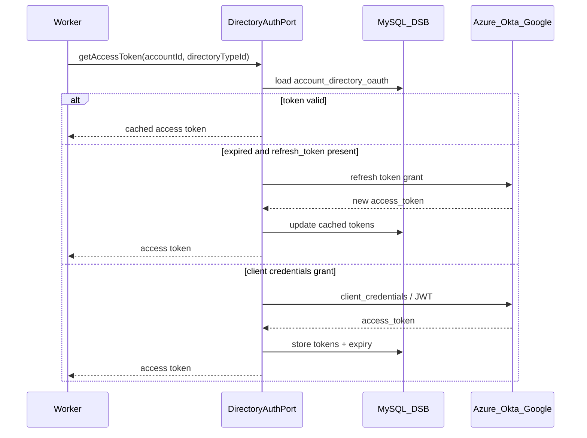

# ADR-008: Directory authentication port (ETM deferred, DSB OAuth Phase 1)

**Status:** Accepted  
**Date:** 2026-05-27  
**AppSec:** Approved (ASWIP-2034) — AES-256 + deploy-time `dsg.crypto.secret-key` for Phase 1 (2026-05-27)  
**Related:** [gap-resolution.md](../prd/gap-resolution.md#gap-6-directory-authentication-etm-deferred--closed-phase-1); [schema-auth-extensions.md](../db/schema-auth-extensions.md)

---

## Context

The architectural wiki routes directory authentication through **ETM** (`etm_subscriber_id` on `account_directory_auth`; `client_id` / `client_secret` not in DSB).

**ETM is not available** as a dependency for Phase 1. DSG still needs OAuth **access** and **refresh** tokens to call Azure Graph, Okta, and Google directory SDKs.

---

## Decision

### `DirectoryAuthPort` (domain interface)

All directory adapters obtain tokens only through this port — never read secrets from adapter code.

```java
public interface DirectoryAuthPort {

  /**
   * Returns a valid access token for the account's directory connection.
   * Refreshes automatically when expired (provider-specific).
   */
  DirectoryAccessToken getAccessToken(String accountId, int directoryTypeId);

  /** Invalidate cached token (e.g. after 401 from directory API). */
  void invalidateToken(String accountId, int directoryTypeId);
}

public record DirectoryAccessToken(
    String accessToken,
    Instant expiresAt,
    String tokenType  // typically "Bearer"
) {}
```

### Implementations (Spring profiles)

| Profile | Bean | When |
|---------|------|------|
| `dsg.auth=dsb-oauth` | `DsbOAuthDirectoryAuthService` | **Phase 1 default** — reads `account_directory_oauth`, refreshes tokens |
| `dsg.auth=etm` | `EtmDirectoryAuthClient` | **Future** — resolves token via `etm_subscriber_id` only; no secrets in DSB |

Workers and `DirectoryPort` adapters inject `DirectoryAuthPort` only.

### Provider token providers (internal to DSB OAuth service)

| Provider | Grant / flow | Refresh |
|----------|--------------|---------|
| **Azure AD** | OAuth 2.0 client credentials (app-only) or authorization code + refresh (delegated) | `POST https://login.microsoftonline.com/{tenantId}/oauth2/v2.0/token` |
| **Okta** | OAuth 2.0 client credentials or API token (if customer uses SSWS) | Okta token endpoint `{oktaDomain}/oauth2/v1/token` |
| **Google** | Service account JWT bearer **or** OAuth 2.0 (Workspace admin consent) | Google token endpoint; service account uses JWT exchange |

Each provider has a **`DirectoryTokenProvider`** strategy selected by `directory_type_id`.

### Account-level configuration in DSB

OAuth client credentials and cached tokens are stored per account — see [schema-auth-extensions.md](../db/schema-auth-extensions.md).

- Admins configure **`client_id`**, **`client_secret`** (and provider-specific fields) via DSG Admin API.
- **`client_id`** stored in plain text (non-secret identifier).
- **`client_secret`** and other sensitive columns encrypted at rest — see [Secret encryption (AES-256)](#secret-encryption-aes-256) below.
- **`etm_subscriber_id`** on `account_directory_auth` remains nullable; used when switching to `dsg.auth=etm`.

### Secret encryption (AES-256)

Because ETM is not ready, secrets live in DSB with **application-level encryption**:

| Item | Approach |
|------|----------|
| Algorithm | **AES-256** (e.g. AES/GCM/NoPadding or AES/CBC with HMAC — finalize in implementation) |
| Key source | `dsg.crypto.secret-key` in Spring `application.properties` / env-specific profile |
| Default in repo | Placeholder key for **local/dev only** — must **not** be used in production |
| Deployment | Replace with real key via env var, secrets manager injection, or mounted config at deploy time |
| Columns encrypted | `client_secret_enc`, `refresh_token_enc`, `access_token_enc`, `google_service_account_key_enc` |
| Service | `SecretEncryptionService` — `encrypt(plainText)` / `decrypt(cipherText)` used only in persistence layer |

**Example configuration:**

```properties
# application.properties (dev placeholder)
dsg.crypto.secret-key=CHANGE_ME_DEV_ONLY_32_BYTE_BASE64_OR_HEX_KEY

# application-prod.properties / deployment override
# dsg.crypto.secret-key=${DSG_CRYPTO_SECRET_KEY}
```

**Operational rules:**

- Never log decrypted secrets.
- Never return `client_secret` on GET APIs (`hasClientSecret: true` only).
- Key rotation: re-encrypt rows when key changes (document runbook; can defer post-MVP).
- ~~AppSec (ASWIP-2034): confirm AES-256 + deploy-time key~~ **Approved** for Phase 1 until ETM.

### Sequence (Phase 1)



---

## Consequences

### Positive

- Unblocks directory SDK work without ETM
- Single swap to ETM later (`dsg.auth=etm`) without changing adapters
- Account-level config matches admin mental model (per RC account, one directory)

### Negative / risks

- DSB holds sensitive material — mitigated by **AES-256** + deploy-time key; AppSec to confirm (ASWIP-2034)
- Wiki target state (secrets only in ETM) deferred; migration path: export oauth rows → ETM subscribers
- Google service-account JSON may need separate storage shape from client_id/secret

### Migration to ETM (future)

1. Create ETM subscriber per `account_directory_auth`.
2. Move credentials into ETM; clear `account_directory_oauth` secret columns.
3. Set `etm_subscriber_id`; enable profile `dsg.auth=etm`.

---

## References

- Wiki section 2.3.1, 2.4.1
- PRD open question: auth model for IDP write-back
