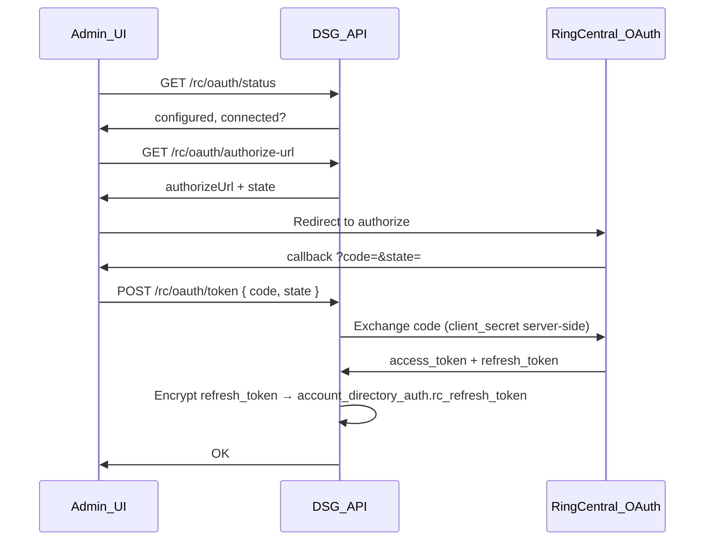

# RingCentral OAuth — local development (standalone admin UI)

Phase 1 standalone React app uses **3-legged OAuth** to obtain RC access tokens for Extensions / provisioning APIs.

**Reference:** [RingCentral authentication](https://developers.ringcentral.com/api-reference/authentication)

Embedded Service Web may pass tokens via JWL in production; this doc covers **local standalone** dev only.

---

## Prerequisites

1. RingCentral developer app with **3-legged OAuth** enabled.
2. Redirect URI registered to match local callback (e.g. `http://localhost:5173/oauth/callback`).
3. Client ID and secret from app owner (not committed to git).

---

## Backend configuration

### General (committed) — `dsg-api/src/main/resources/application.yml`

Placeholder keys are substituted at deploy time via environment variables:

| Property | Env var | Default |
|----------|---------|---------|
| `dsg.rc.client-id` | `DSG_RC_CLIENT_ID` | empty |
| `dsg.rc.client-secret` | `DSG_RC_CLIENT_SECRET` | empty |
| `dsg.rc.server-url` | `DSG_RC_SERVER_URL` | `https://platform.devtest.ringcentral.com` |
| `dsg.rc.redirect-uri` | `DSG_RC_REDIRECT_URI` | `http://localhost:5173/oauth/callback` |

### Local dev (gitignored) — `application-local.yml`

```bash
cp dsg-api/src/main/resources/application-local.yml.example \
   dsg-api/src/main/resources/application-local.yml
```

Edit `application-local.yml` and set your Client ID and Client Secret:

```yaml
dsg:
  rc:
    client-id: <your-rc-client-id>
    client-secret: <your-rc-client-secret>
    server-url: https://platform.devtest.ringcentral.com
    redirect-uri: http://localhost:5173/oauth/callback
```

Start backend with the `local` profile ( `./scripts/dev-run.sh` activates it when the file exists).

---

## Flow



1. User opens admin UI → **RcAuthGuard** checks `/rc/oauth/status`.
2. If not connected, UI fetches authorize URL and redirects to RingCentral login.
3. After consent, callback page POSTs the code to the Java server.
4. Server exchanges the code using `client-id` / `client-secret` from config.
5. Refresh token is AES-256 encrypted (same key as directory client secrets) and stored in `account_directory_auth.rc_refresh_token`.
6. Sync jobs call `RcAuthPort.obtainAccessToken(accountId)` to refresh access tokens for RingCentral API calls.

**Note:** Directory (IDP) OAuth is separate — [directory-auth-api-spec.md](directory-auth-api-spec.md).

---

## Security

- Never commit `application-local.yml` or `RC_CLIENT_SECRET`.
- Client secret stays on the server; the browser never sees it.
- Rotate refresh tokens per RC policy.

---

## Related

- [mockup-alignment.md](../ui/mockup-alignment.md) — IDP Authorization card vs RC login
- [ADR-008](../adr/008-directory-auth-port.md) — directory tokens only
