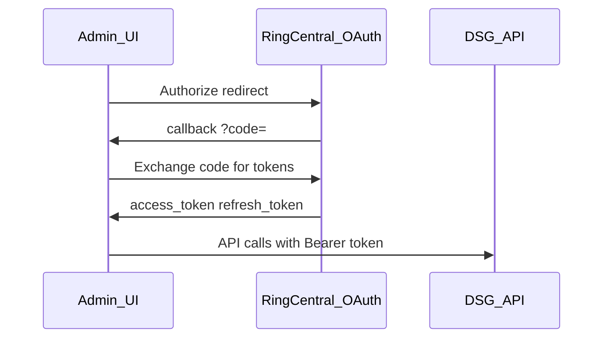

# RingCentral OAuth — local development (standalone admin UI)

Phase 1 standalone React app uses **3-legged OAuth** to obtain RC access tokens for Extensions / provisioning APIs.

**Reference:** [RingCentral authentication](https://developers.ringcentral.com/api-reference/authentication)

Embedded Service Web may pass tokens via JWL in production; this doc covers **local standalone** dev only.

---

## Prerequisites

1. RingCentral developer app with **3-legged OAuth** enabled.
2. Redirect URI registered to match local hostname (not raw `localhost` if app forbids it).
3. Client ID and secret from app owner (not committed to git).

---

## `/etc/hosts` setup

Map a stable hostname to localhost:

```
127.0.0.1  dsg.local
```

Example redirect URI: `https://dsg.local:5173/oauth/callback`

---

## Environment variables (placeholder)

```bash
RC_CLIENT_ID=<provided-later>
RC_CLIENT_SECRET=<provided-later>
RC_SERVER_URL=https://platform.devtest.ringcentral.com
RC_REDIRECT_URI=https://dsg.local:5173/oauth/callback
```

Store in `.env.local` (gitignored).

---

## Flow



1. User clicks **Login** → redirect to RC authorize URL.
2. User consents → redirect to `RC_REDIRECT_URI` with `code`.
3. UI exchanges `code` for `access_token` (server-side or secure BFF recommended for `client_secret`).
4. UI attaches `Authorization: Bearer {access_token}` to DSG admin calls that proxy RC, or DSG stores short-lived session server-side (implementation choice).

**Note:** Directory (IDP) OAuth is separate — [directory-auth-api-spec.md](directory-auth-api-spec.md).

---

## Security

- Never commit `RC_CLIENT_SECRET`.
- Use HTTPS locally (Vite/dev cert or reverse proxy) if RC requires HTTPS redirect.
- Rotate refresh tokens per RC policy.

---

## Related

- [mockup-alignment.md](../ui/mockup-alignment.md) — IDP Authorization card vs RC login
- [ADR-008](../adr/008-directory-auth-port.md) — directory tokens only
