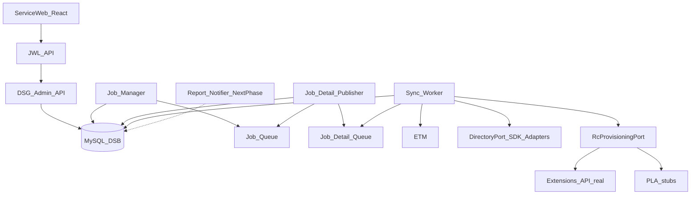

# Unified architecture — DSG

Consolidates [product PRD](../prd/directory-integration-2.0.md), [design wiki](dsg-design-wiki.md), and [gap resolutions](../prd/gap-resolution.md).

## Configuration vs runtime

| Plane | Module | Responsibility |
|-------|--------|----------------|
| **Configuration** | `dsg-api` | Directory OAuth, group scope, mappings, rules, scheduler, deprovision policy |
| **Runtime** | `dsg-worker` + publishers | FULL / INCREMENTAL / ON_DEMAND jobs; IDP pull; RC provision/update/delete |

**Per-account job mutex:** Only one non-terminal job per account; concurrent triggers return `409`. See [sync-runtime.md](sync-runtime.md).

**Event model:** Scheduled pull + on-demand jobs in Phase 1 (no SCIM webhooks). See [ADR-001](../adr/001-event-model.md).

## Stack

| Layer | Technology |
|-------|------------|
| Admin UI | React, TypeScript, Tailwind (Service Web / SCL → JWL → DSG) |
| Backend | Java, Spring Boot (`dsg-api`, `dsg-worker`, `dsg-domain`, `rules-engine`) |
| Database | MySQL (DSB), Flyway |
| Messaging | **ElasticMQ first** (local, SQS-compatible API); AWS SQS in prod ([ADR-002](../adr/002-queue-abstraction.md)) |
| IDP auth | `DirectoryAuthPort` — DSB OAuth Phase 1; ETM when ready ([ADR-008](../adr/008-directory-auth-port.md)) |

## Components

> `Report_Notifier` (email on job complete) is **next phase** per [ADR-005](../adr/005-sync-report-notification.md). Phase 1 uses `job` / `job_detail` + report query API only.

## User lifecycle handling (Phase 1)

| Event | Trigger type | Behavior |
|-------|--------------|----------|
| New user in directory group | Type 1 — Provision | Evaluate `provisioning_assignment_rule` by priority; apply mappings + one-time assignments |
| Mapped attribute value changed | Type 2 — Change (**implicit**) | Hash/compare `attribute_mapping` + `custom_attribute_mapping`; UPDATE RC if changed |
| User removed / delete event | Type 3 — Delete | `deprovisioning_rule` policy |
| RC number/extension changed | Reverse sync (P0-3) | RC→DIR worker path; separate from Type 2 |

Full decision record: [ADR-003](../adr/003-rule-triggers-and-action-sets.md).

## Sync reporting (P0-9)

| Phase | Capability |
|-------|------------|
| Phase 1 | `job` / `job_detail` persistence; `GET .../jobs/{jobId}/report`; Service Web job history |
| Next phase | Email notifier on job completion; optional recipient configuration |

See [ADR-005](../adr/005-sync-report-notification.md).

## Number assignment (P0-2)

Phase 1: area code from IDP via `dl_area_code_assignment`; assign from **RC number inventory only**; fail loudly if stock insufficient. No purchase or PoA path.

See [ADR-006](../adr/006-number-assignment-inventory-only.md).

## Directory integration (Gap 5 — not Gap 4)

Phase 1: vendor **directory SDKs** behind `DirectoryPort` (Azure Graph, Okta, Google, OneLogin). **No SCIM** protocol. Gap 4 is **queues only**.

**Gap 4 (queues):** Develop against **ElasticMQ** locally (`docker compose up`); production uses SQS — same API via [ADR-002](../adr/002-queue-abstraction.md).

See [ADR-004](../adr/004-directory-sdk-adapters.md).

## Monitoring

| Metric | Purpose |
|--------|---------|
| `sync_job_completed_total` / success rate | PRD ≥ 95% provisioning success |
| `job_detail_failed_total` by error code | P0-9 / P1-2 diagnostics |
| `job_stuck_count` | Jobs with details still InSync past threshold |
| `idp_429_retry_total` | Rate limit health |
| `reverse_sync_push_failed_total` | P0-3 alerts |

Logs: structured with `account_id`, `job_id`, `job_detail_id`, `external_id`.

## References

- [traceability.md](../prd/traceability.md)
- [gap-resolution.md](../prd/gap-resolution.md)
- [dsg-openapi.yaml](../api/dsg-openapi.yaml)
