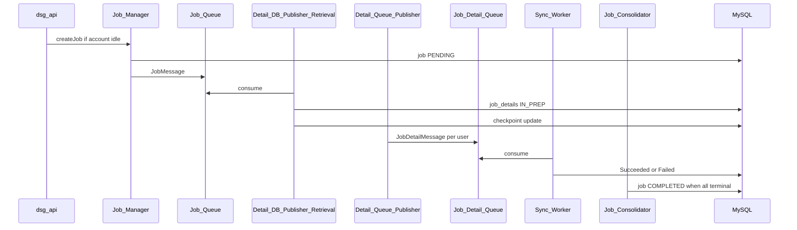

# Sync runtime architecture

Configuration plane vs sync execution for DSG. Complements [overview.md](overview.md) and [dsg-design-wiki.md](dsg-design-wiki.md) §3.3.

---

## Two backend planes

| Plane | Module | Responsibility |
|-------|--------|----------------|
| **Configuration** | `dsg-api` (REST) | Persist directory connection, mappings, rules, scheduler; serve admin UI |
| **Runtime** | `dsg-worker` library + `@Scheduled` consumers in **same JVM** as `dsg-api` | Execute FULL / INCREMENTAL / ON_DEMAND jobs; call IDP + RC |

Configuration APIs do not provision users. Runtime does not mutate rule definitions.

---

## Job types

| Type | Trigger | Behavior |
|------|---------|----------|
| `FULL` | Admin or schedule | Full directory group membership scan |
| `INCREMENTAL` | Scheduler (~4h in UX) | Delta via `directory_sync_checkpoint` |
| `ON_DEMAND` | UI actions | Subset: preview, manual sync, **selected users**, **failed-user retry** |

Failed-user retry: create ON_DEMAND job with `externalUserIds` from prior job where `job_detail` status = Failed.

---

## Pipeline (parallel consumers)

**Deployment (Phase 1 POC):** one Spring Boot process (`dsg-api` main) hosts the Admin API and all runtime consumers. Logical components map to Spring `@Scheduled` tasks on the shared scheduler thread pool — not separate OS processes.

### Job states

`PENDING` → `IN_PREP` → `READY` → `IN_SYNC` → `COMPLETED` | `CANCELLED` | `FAILED` | `STUCK`

Detail states: `Pending` → `InSync` → `Succeeded` | `Failed`

---

## Per-account job mutex

**Rule:** If any `job` for `account_id` is in a **non-terminal** state, reject a new `FULL`, `INCREMENTAL`, or `ON_DEMAND` job.

Non-terminal: `PENDING`, `IN_PREP`, `READY`, `IN_SYNC`, `CANCELLING`.

| API | Response |
|-----|----------|
| `POST /dsg/v1/{accountId}/jobs` when busy | `409 Conflict` — `JOB_ALREADY_RUNNING` |

Scheduler must skip enqueue when mutex active.

---

## Worker operations per `job_detail`

| `operation_type` | When | Actions |
|------------------|------|---------|
| `CREATE` | New user in scope | Match provision rules; mappings; licenses; phone; device; templates |
| `UPDATE` | Mapped fields changed (hash) | Patch RC only — **no** reprovision rules |
| `DELETE` | Removed from directory | `deprovisioning_rule` policy |

See [ADR-003](../adr/003-rule-triggers-and-action-sets.md).

---

## 429 handling

| Level | Queue | Behavior |
|-------|-------|----------|
| Account / batch | Job queue | Re-queue job with backoff |
| Per user | Job detail queue | Retry detail; max attempts → Failed |

---

## Reporting

Consolidator sets terminal job state. Phase 1: `GET .../jobs/{jobId}/report`. Email notifier deferred — [ADR-005](../adr/005-sync-report-notification.md).

---

## References

- [ADR-001](../adr/001-event-model.md) — scheduled pull model
- [ADR-002](../adr/002-queue-abstraction.md) — queues
- [dsg-openapi.yaml](../api/dsg-openapi.yaml) — `POST /jobs`
