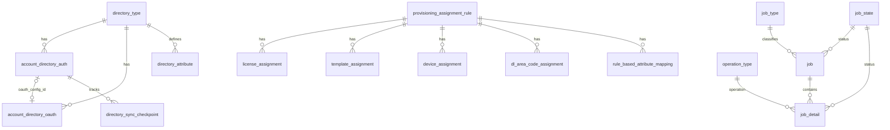

# DSB entity relationship diagram

Mermaid source (wiki baseline + `account_directory_oauth`). Copy to `erd.mmd` if your tooling requires `.mmd`.

Full table definitions: [dsb-schema-wiki.md](dsb-schema-wiki.md).
