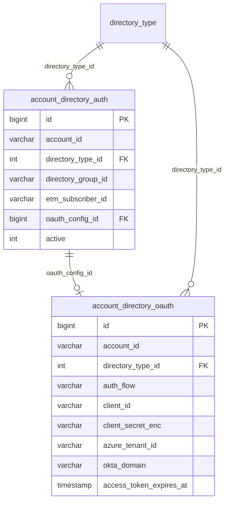

# DSB schema extensions — directory OAuth (ETM deferred)

Extends wiki tables in [dsg-design-wiki.md](../architecture/dsg-design-wiki.md) section 2.4.1.

**ADR:** [008-directory-auth-port.md](../adr/008-directory-auth-port.md)

---

## Design intent

| Wiki (target) | Phase 1 (ETM not ready) |
|---------------|-------------------------|
| `directory_type` — type metadata only | Unchanged |
| Secrets in ETM | **`account_directory_oauth`** in DSB (encrypted) |
| `account_directory_auth.etm_subscriber_id` | Optional; null in Phase 1 |

**Constraint:** One directory type per account (wiki note) — one row in `account_directory_auth`, one row in `account_directory_oauth`.

---

## Table: `account_directory_oauth`

Account-level OAuth / API credentials for directory API access.

| Column | Type | Comment |
|--------|------|---------|
| `id` | bigint PK | |
| `account_id` | varchar(64) FK | RC account UID |
| `directory_type_id` | int FK | Azure, Okta, Google, OneLogin |
| `auth_flow` | varchar(32) | `CLIENT_CREDENTIALS`, `AUTHORIZATION_CODE`, `OKTA_API_TOKEN`, `GOOGLE_SERVICE_ACCOUNT` |
| `client_id` | varchar(512) | OAuth client ID or Okta client ID |
| `client_secret_enc` | varchar(2048) | **AES-256** ciphertext (Base64); key from `dsg.crypto.secret-key` — [ADR-008](../adr/008-directory-auth-port.md) |
| `azure_tenant_id` | varchar(64) | Azure AD tenant (nullable) |
| `okta_domain` | varchar(256) | e.g. `https://dev-123.okta.com` (nullable) |
| `google_workspace_admin` | varchar(256) | Subject for domain-wide delegation (nullable) |
| `google_service_account_key_enc` | text | AES-256 encrypted JSON key file (nullable; alternative to client_secret) |
| `refresh_token_enc` | varchar(2048) | AES-256; populated after admin consent (nullable) |
| `access_token_enc` | varchar(2048) | AES-256 cached access token |
| `access_token_expires_at` | timestamp | Used by `DirectoryAuthPort` refresh logic |
| `scopes` | varchar(1024) | Space-separated granted scopes |
| `created_on` | timestamp | |
| `updated_on` | timestamp | |

**Unique:** `(account_id, directory_type_id)`

### Provider-specific required fields

| directory_type | auth_flow | Required columns |
|----------------|-----------|------------------|
| Azure | `CLIENT_CREDENTIALS` or `AUTHORIZATION_CODE` | `client_id`, `client_secret_enc`, `azure_tenant_id` |
| Okta | `CLIENT_CREDENTIALS` or `OKTA_API_TOKEN` | `client_id`, `client_secret_enc`, `okta_domain` (token flow may use SSWS API token as “secret”) |
| Google | `GOOGLE_SERVICE_ACCOUNT` or OAuth | `google_service_account_key_enc` **or** `client_id` + `client_secret_enc` + `google_workspace_admin` |

---

## Table: `account_directory_auth` (wiki baseline + Phase 1)

Keep wiki columns; Phase 1 usage:

| Column | Phase 1 |
|--------|---------|
| `etm_subscriber_id` | **Nullable** until ETM ready |
| `directory_group_id` | Set via admin API |
| `active` | 0/1 |
| `directory_type_id` | FK |

**Do not** store `client_secret` in plain text on this table.

Optional link:

| Column | Type | Comment |
|--------|------|---------|
| `oauth_config_id` | bigint FK | → `account_directory_oauth.id` |

---

## ER fragment

---

## Admin API (configuration)

See [dsg-admin-api-spec.md](../api/dsg-admin-api-spec.md) — `PUT /directory/oauth`.

Secrets submitted once on create/update; never returned on GET (mask `client_id` only).

---

## Security notes (AppSec)

- **Encryption:** AES-256 via `SecretEncryptionService`; master key in `dsg.crypto.secret-key` (property placeholder locally; **real key at deployment**) — **AppSec approved** (ADR-008)
- **`client_id`:** plain text in DSB (not encrypted)
- Restrict DSG Admin API to Service Web authenticated admin roles
- Audit log: credential created/updated (not values)
- EU accounts: same schema in EU DSG/DSB per wiki compliance section
